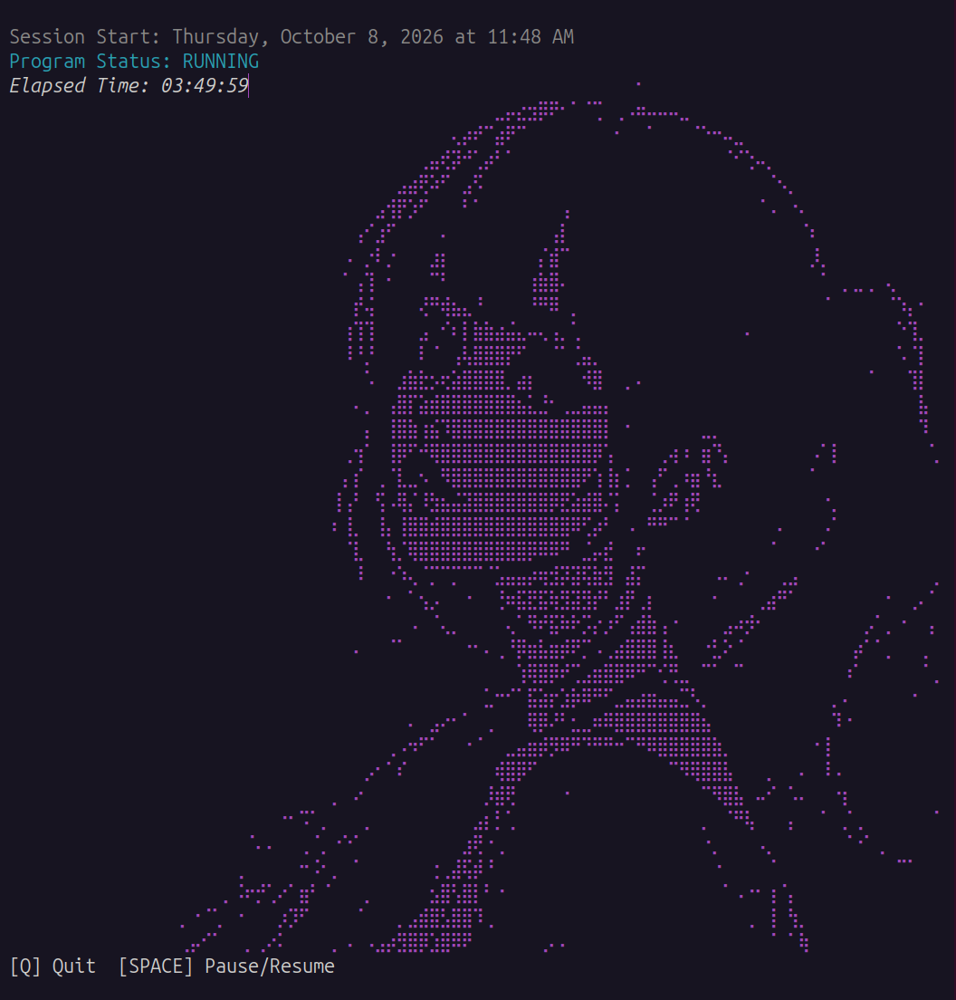
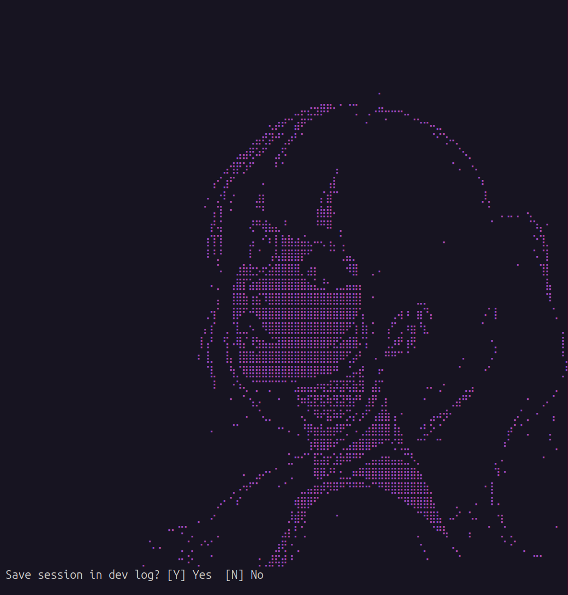
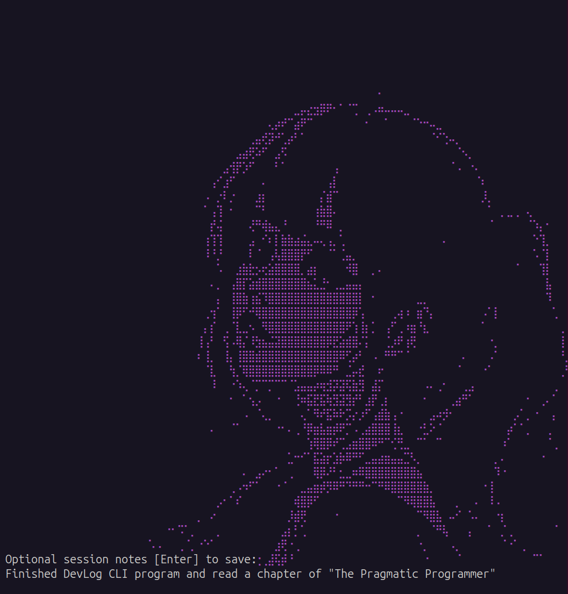
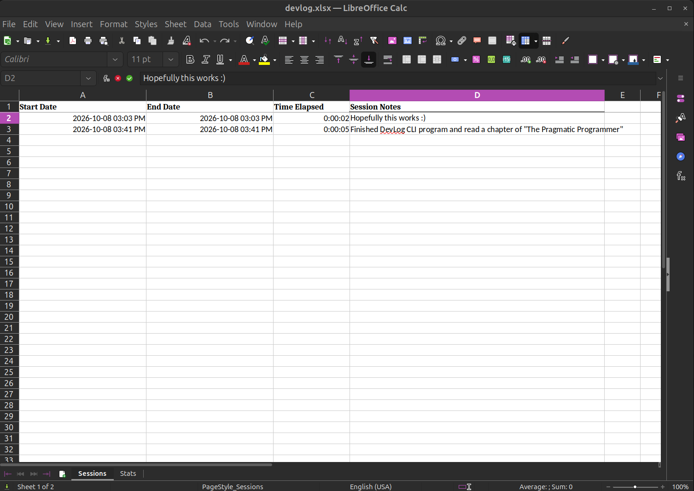
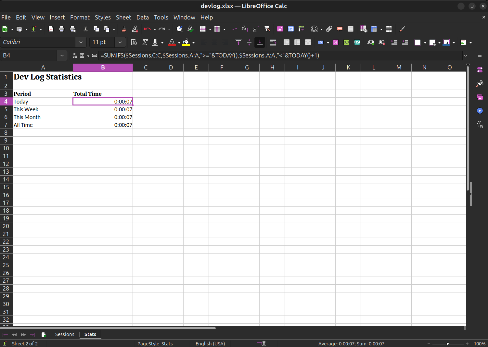

# DevLog

DevLog is a terminal-based time tracker built for developers. Track time spent coding, debugging, learning, and working on projects. Record session notes and monitor your daily, weekly, monthly, and all-time development hours.

## Features

- **Session Timer:** Track time spent on development tasks.
- **Suspend Support:** Accurately tracks elapsed time even when your computer is suspended.
- **Pause and Resume:** Pause and resume sessions as needed.
- **Session Logging:** Save completed sessions with start times, end times, durations, and optional notes.
- **Excel Integration:** Automatically store session history in an Excel workbook.
- **Development Statistics:** View daily, weekly, monthly, and all-time tracked hours.
- **Terminal Interface:** Manage sessions through a lightweight terminal UI.
- **Customizable ASCII Art:** Personalize the interface by editing `ascii_art.py`.
- **Customizable Colors:** Customize the terminal colors by modifying the color settings in `ui/ui_constants.py`.

## Screenshots

<p align="center">
  
  
  
</p>

<p align="center">
  
  
</p>

## Built With
- Python
- curses
- openpyxl

## Requirements

- Python 3.12+
- A compatible terminal
- Dependencies listed in `requirements.txt`

## Installation

### Linux / macOS

**1. Clone the repository**

```bash
git clone https://github.com/TommyJu/devlog.git
cd devlog
```

**2. Create a virtual environment**

```bash
python3 -m venv .venv
```

**3. Activate the virtual environment**

```bash
source .venv/bin/activate
```

**4. Install dependencies**

```bash
python -m pip install -r requirements.txt
```

### Windows

**1. Clone the repository**

```powershell
git clone https://github.com/TommyJu/devlog.git
cd devlog
```

**2. Create a virtual environment**

```powershell
py -m venv .venv
```

**3. Activate the virtual environment**

```powershell
.venv\Scripts\Activate.ps1
```

If PowerShell blocks activation, you can use Command Prompt instead:

```bat
.venv\Scripts\activate.bat
```

**4. Install dependencies**

```powershell
python -m pip install -r requirements.txt
```

## Usage

With your virtual environment activated, run:

```bash
python main.py
```

Follow the on-screen controls to manage your coding session.

Completed sessions are saved to `devlog.xlsx` in the current working directory.

**Tip:** Consider creating a shell script to launch DevLog from anywhere without manually activating the virtual environment.